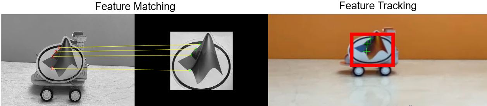
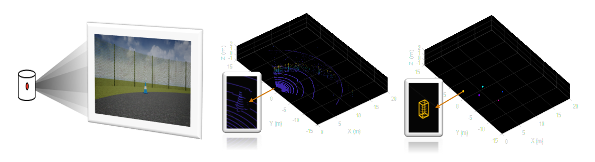

# Making Vehicles and Robots See: Getting Started with Perception for Students

This submission contains all of the example and exercise materials for the online tutorial series - [Making Vehicles and Robots See: Getting Started with Perception for Students](https://www.mathworks.com/videos/series/making-vehicles-and-robots-see-getting-started-with-perception-for-students.html). 
Link to the video series: [https://www.youtube.com/playlist?list=PLn8PRpmsu08pMH5wexyjc_4ludkyYvhqo](https://www.youtube.com/playlist?list=PLn8PRpmsu08pMH5wexyjc_4ludkyYvhqo).

While designing autonomous systems, there is typically a requirement to 'see' the environment. It could be an underwater vehicle navigating through obstacles, or a formula student car maneuvering through cones, or robot picking and placing an object. 

This tutorial series will help you get started with the practical approaches while working with perception algorithms and how to tackle them. We will use MATLAB&reg; as the platform to understand the algorithms and apply the techniques learnt using Simulink&reg; through the exercises. 

- Part 1: Basic Operations on Images - Link to Video [https://www.youtube.com/watch?v=GKVLY0iFyK0&list=PLn8PRpmsu08pMH5wexyjc_4ludkyYvhqo&index=1](https://www.youtube.com/watch?v=GKVLY0iFyK0&list=PLn8PRpmsu08pMH5wexyjc_4ludkyYvhqo&index=1)
- Part 2: Image Segmentation and Analysis - Link to Video [https://www.youtube.com/watch?v=-bYKl64vpGY&list=PLn8PRpmsu08pMH5wexyjc_4ludkyYvhqo&index=2](https://www.youtube.com/watch?v=-bYKl64vpGY&list=PLn8PRpmsu08pMH5wexyjc_4ludkyYvhqo&index=2)
- Part 3: Features Matching and Tracking - Link to Video [https://www.youtube.com/watch?v=rbjybw9UyOg&list=PLn8PRpmsu08pMH5wexyjc_4ludkyYvhqo&index=3](https://www.youtube.com/watch?v=rbjybw9UyOg&list=PLn8PRpmsu08pMH5wexyjc_4ludkyYvhqo&index=3)
- Part 4: Basics on Point Cloud Processing - Link to Video [https://www.youtube.com/watch?v=-k8CKky5Aqc&list=PLn8PRpmsu08pMH5wexyjc_4ludkyYvhqo&index=4](https://www.youtube.com/watch?v=-k8CKky5Aqc&list=PLn8PRpmsu08pMH5wexyjc_4ludkyYvhqo&index=4)]

## About the Folders ##
1. *1_basic_operations_on_images*: 
	- This folder contains files to work with the basic operations such as reading, displaying, resizing, cropping, rotating, filtering and enhancement on images in MATLAB. 
	- It concludes with an exercise to perform the learnt basic operations on images in Simulink.
 

2. *2_image_segmentation_and_analysis*
    - This folder contains files to segment an image based on colors, refine these detections, and analyze the resulting image regions all using interactive apps available in MATLAB. 
    - It concludes with an exercise to perform color-based segmentation and blob detection using Simulink.
 

3. *3_feature_matching_and_tracking*
    - This folder contains files to detect, describe and match features between two images (demo1), and then to track an object in a video based on image features (demo2) using MATLAB. 
    - It concludes with an exercise to perform video recovery using feature matching in Simulink.
 

4. *4_basics_on_point_cloud_processing*
    - This folder contains files for introducing the basics of point cloud processing by showing how to estimate the locations of objects in a 3D space using point clouds in MATLAB. 
    - It concludes with an exercise to perform location estimation of poles using a point cloud generated by an aerial vehicle.
 

## About the Files ##

The main folder is divided as Parts specficified above. Each folder has files the following structure:
- **code**: Contains MATLAB [Live Scripts](https://www.mathworks.com/help/matlab/matlab_prog/what-is-a-live-script-or-function.html) with all the commands used during the tutorial. 
	- Open the MATLAB Live Script (.MLX file) 
	- Step through each section of the code
	- Interact with the [controls](https://www.mathworks.com/help/matlab/matlab_prog/add-interactive-controls-to-a-live-script.html) to see the result of the corresponsing operations. 
- **exercise**: Recommended exercises to apply the concepts learnt from the video.
	- Open the folder and the Simulink model
	- Fill the blank areas in the Simulink model according to the problem statement

## Recommendations ##
- Before Begining the series:
	- Complete [MATLAB Onramp](https://www.mathworks.com/learn/tutorials/matlab-onramp.html)
- During/After the series:
	- Complete [Image Processing Onramp](https://www.mathworks.com/learn/tutorials/image-processing-onramp.html)
	-  Complete [Simulink Onramp](https://www.mathworks.com/learn/tutorials/simulink-onramp.html)

## Product Requirements ##

The model use the following MathWorks products:

1. MATLAB
2. Simulink
3. Image Processing Toolbox &trade;
4. Computer Vision Toolbox &trade;
5. Lidar Toolbox &trade;

In case of any questions, please reach out to us at roboticsarena@mathworks.com.

Copyright 2021 The MathWorks, Inc.

